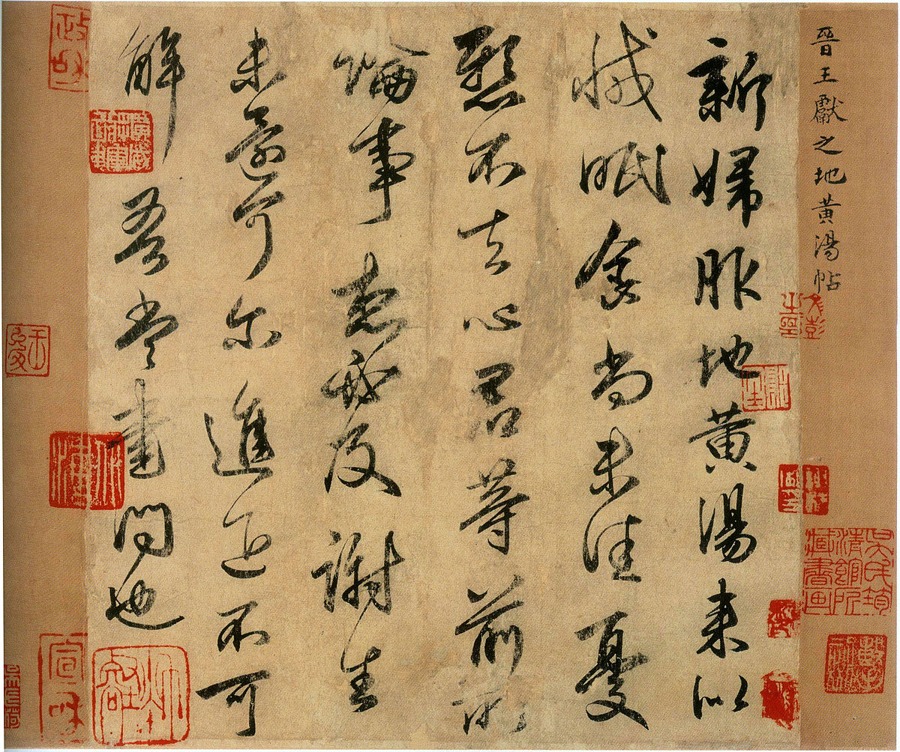
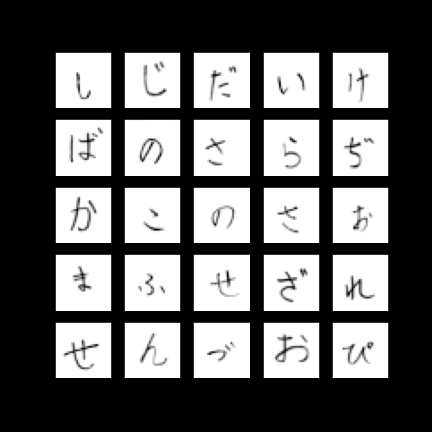
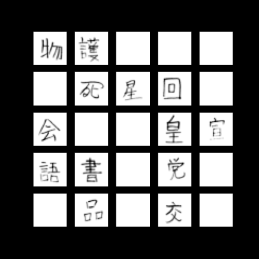
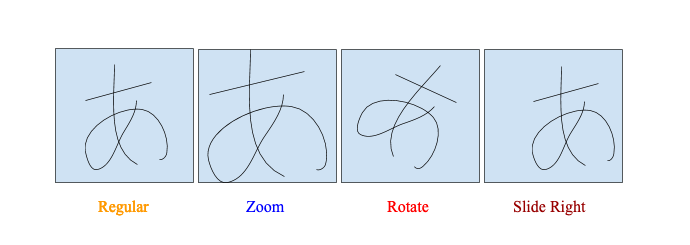
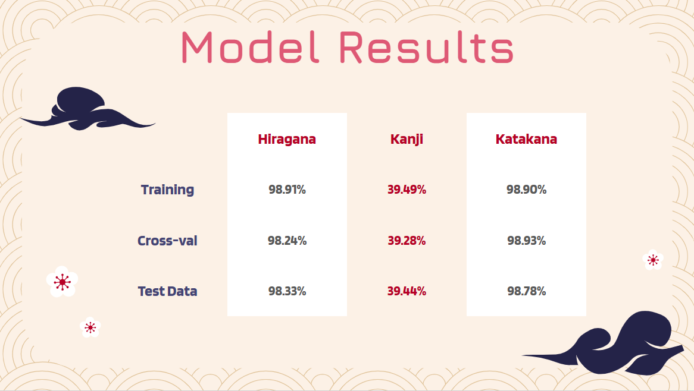

# Japanese Character Image Recognition

Author: Chaz Frazer<br>

# Overview
This project applies neural network machine learning using CNN to correctly identify Japanese characters. The three writing systems of Japan (hiragana, katakana, kanji) are represented and modeled individually.<br><br>

# Business Problem
This project aims to tackle the issue of accurately transcribing handwritten characters and to be identified by image modeling and NLP. In a linguistic and archival sense, this would do well to preserve ancient writings and transcribe important texts much more quickly.<br>
Also connected to linguistics, can this model serve as a base for an educational handwriting recognition API (ie. used in a dictionary app for searching by radical, mora, and character).<br><br>

# Data
The data is from the National Institute of Advanced Industrial Science and Technology (AIST) and was reorganized by the Japan Electronics and Information Technology Industries Association. There are about 1.2 million handwritten Japanese records written by tens of thousands of individuals including numerals, hiragana, katakana, and kanji. Collected from 1973 to 1984, the data was sent to AIST by submission of magnetic tapes and CD-R delivered by post. 
<br><br>

# Data Cleaning & EDA
The data was read in from binary, sorted and then saved to an npz file for further access and to model upon. Once done and training labels were created, the data images were able to be rendered for inspection. <br>
<br>

The same was done for each separate writing system. In total 2 datasets were used, as hiragana and a subset of the kanji dataset was put together into 1 by AIST. <br>
 <br><br>

# Feature Engineering
The data was resized to 48x48 pixels for our CNN model to read over. A Tensorflow ImageDataGenerator filter was put over the images at random to create variability in our data. 
This was done to enhance our variety in the dataset (although different handwriting styles have already done this to an extent for us), and to reduce the chance of our model overfitting.<br>
<br><br>

# Modeling & Results
After our EDA and feature engineering we were ready to begin our modeling the process. Below is a summary of results from the three CNN models that were run for each writing system.
Our final dataset sizes for modeling were:
* Hiragana: 9,088 images (training & validation)
* Kanji: 97,776 images (training & validation)
* Katakana: 51,924 images (training & validation)<br><br>

After modeling each writing system, and experimenting with various parameters and hyperparameters, our results were as below:<br>

<br><br>

# Next Steps
* Fine tune model params for kanji model to achieve higher accuracy
* Further dive into Tensorboard to view for live modeling (did post model in this notebook)
* Implement cloud-based modeling using other model techniques. Running in the cloud on multiple GPUs will speed up production time and lessen the strain on my work rig
* Combine datasets in the future to work on an image classification model that can identify the type of character (hiragana, katakana, kanji, romanji, numerals) for capstone
* Expand model for touchscreen API integration for language education (iOS app) <br><br>

# References
* ELTCDB Data Set -- http://etlcdb.db.aist.go.jp/<br>
* AIST -- http://www.aist.go.jp/index_e.html <br>
* JEITA -- http://www.jeita.or.jp/english/<br><br>

# Repository Structure
```
├── img
├── logs
├── models
├── trials
│   └── kana_recognition_workbook.ipynb
├── .gitignore
├── README.md
├── japanese_character_image_recognition.ipynb
└── jcir_presentation.pdf